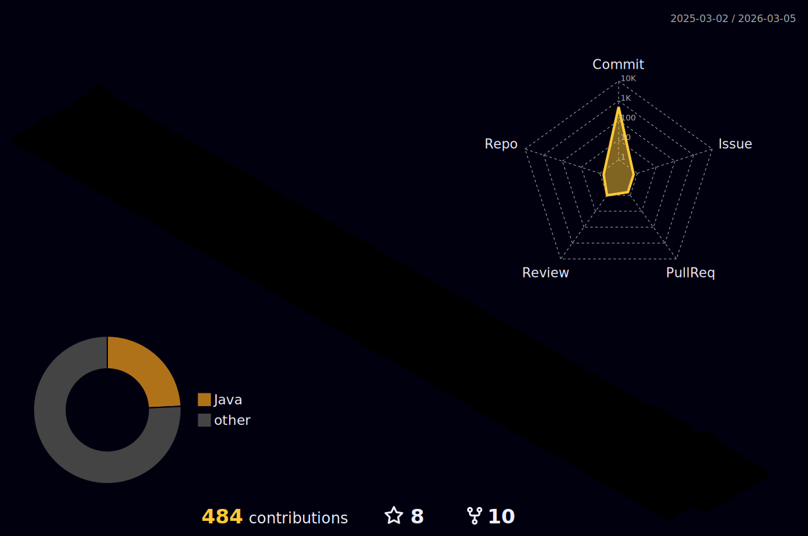

<!-- Badges -->

  
    
  
   
     
  
  
  
  
  

  

### 🖐 성장을 위해 꾸준히 학습하는 개발자 강수민입니다.
- 개발 자체에 대한 이해와 나만의 서비스 구축에 대한 목표를 갖고 FE, BE 모두 학습하며 프로젝트를 진행했습니다.
- 백엔드 개발과 클라우드 및 플랫폼 구축에 관심이 많으며 관련 경험을 쌓기 위해 강의를 학습하거나 AWS SAA(Solutions Architect Associate) 등 자격증도 준비하고 있습니다.
- 실사용자 처리 경험을 위해 SpringBoot, React, Gitgub Projtect를 활용한 사이드 프로젝트를 진행하며 Docker, Docker-compose, Nginx 등 플랫폼 개발과 인프라 관련 기술도 학습하고 있습니다.

### 🎓 EXPERIENCE
- 2023.01 ~ 2023.12.29    삼성 청년 SW 아카데미 9기
- 2017.03 ~ 2003.02    국립공주대학교 소프트웨어학과
- 2022.02 ~ 2022.07    프로그래머스 자율주행 데브코스 3기

### 🔥 Now Dev

 

<!-- 백준 티어 -->
<!-- Github Stats Card -->
  
<!-- Github 3D Profile -->

